# Credit_Risk_Analysis

## Overview of the Credit Risk Analysis:

Since risk is an inherently unbalanced classification problem, different algorithms were tested using a credit card dataset from LendingClub to find the algorithm or algorithms that best predicts credit risk.

## Results

### Oversampling

First, data was oversampled using the Naive Random Oversampling (RandomOverSampler) and SMOTE algorithms.

**Naive Random Oversampling:**

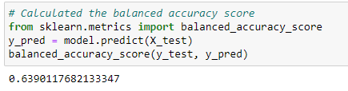

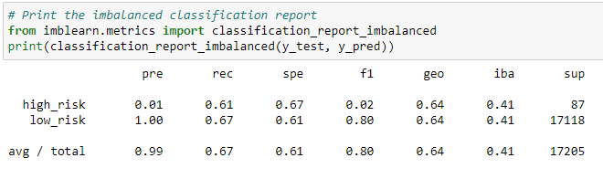

Using this algorithm:
- The balanced accuracy score was 64%
- The high risk precision rate was 1% with the recall at 61%
- The low risk precision rate was 100% with the recall at 67%
- The average/total precision rate was 99% with the recall at 67%

**SMOTE Oversampling:**

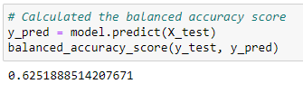

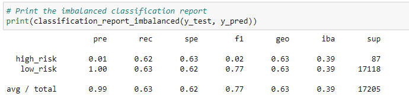

Using this algorithm:
- The balanced accuracy score was 63%
- The high risk precision rate was 1% with the recall at 62%
- the low risk precision rate was 100% with the recall at 63%
- The average/total precision rate was 99% with the recall at 63%

### Undersampling

Secondly, the data was undersampled using the Cluster Centroids algorithm.

**Cluster Centroids:**

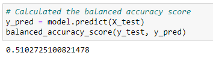

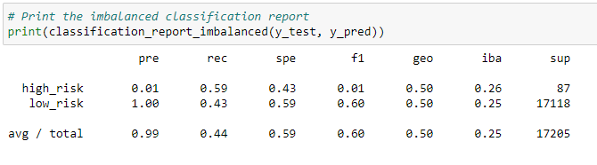

Using this algorithm:
- The balanced accuracy score was 51%
- The high risk precision rate was 1% with the recall at 59%
- the low risk precision rate 100% was with the recall at 43%
- The average/total precision rate was 99% with the recall at 44%

### Combination (Over and Under) Sampling

Third, a combinational approach of over- and undersampling using the SMOTEENN algorithm was used.

**SMOTEENN:**

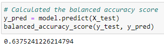

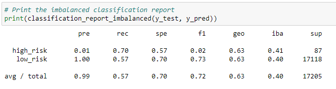

Using this algorithm:
- The balanced accuracy score was 64%
- The high risk precision rate was 1% with the recall at 70%
- the low risk precision rate was 100% with the recall at 57%
- The average/total precision rate was 99% with the recall at 57%

### Ensemble Learners

Fourth, two ensemble models that reduce bias was used, Balanced Random Forest Classifier and Easy Ensemble AdaBoost Classifier.

**Balanced Random Forest Classifier:**

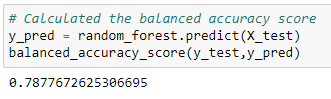

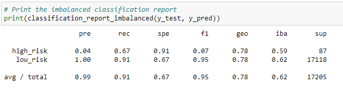

Using this algorithm:
- The balanced accuracy score was 79%
- The high risk precision rate was 4% with the recall at 67%
- the low risk precision rate was 100% with the recall at 91%
- The average/total precision rate was 99% with the recall at 91%

**Easy Ensemble AdaBoost Classifier:**

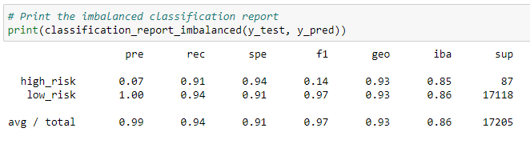

Using this algorithm:
- The balanced accuracy score was 93%
- The high risk precision rate was 7% with the recall at 91%
- the low risk precision rate was 100% with the recall at 94%
- The average/total precision rate was 99% with the recall at 94%

## Summary

From the results of the six models ran, the Easy Ensemble AdaBoost Classifier yielded the best results with a balanced accuracy rate of 93%. Although a number of models including the Easy Ensemble model had a precision rate of 100% for low risk, the recall for the Easy Ensemble was the highest at 94%. The Easy Ensemble model also had a high risk precision rate of 7% with a recall rate of 91%, which was the highest numbers for all the models tested.

Although out of the six models the Easy Ensemble model would be the recommended model, the low percentages for predicting high risk groups in the results for all the models would make it hard to recommend any of the algorithms for that purpose. However, if there were a higher number of high risk numbers to test (there were only 347 as opposed to 68,470 low risk values), perhaps a better outcome could be achieved.
